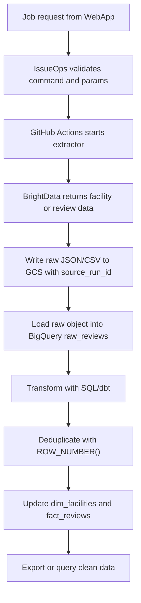
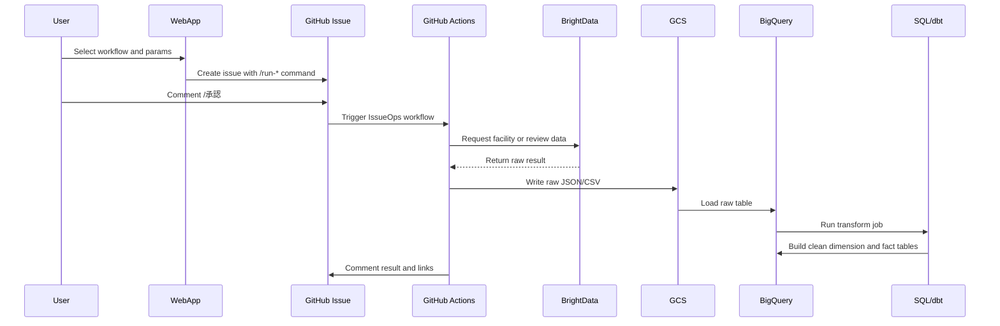
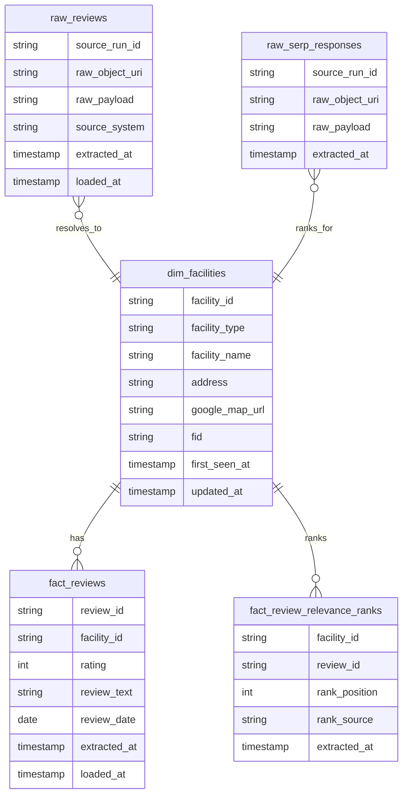

# 1000man Programmer Project v2

このリポジトリは、`mememori8888/demo` の機能を損なわずに、1000万円超えを狙えるプログラマーの実践テーマとして再設計する新バージョンです。

既存 demo の `WebApp -> Issue -> GitHub Actions -> データ出力` の運用は保持します。そのうえで、Python が巨大 CSV を抱えて照合・重複排除する構成から、`Google Cloud Storage + BigQuery` を中心にしたモダン ELT へ移行します。

## マインドセット

「動く」だけのコードは、データ量や会員数が増えた瞬間にコストと処理時間を爆発させます。このプロジェクトでは、動くコードを維持するだけでなく、スケールしても安く、速く、正しく動く設計へ移すことを目的にします。

| 層 | 典型的な対応 | 結果 |
| --- | --- | --- |
| 年収600万層 | クラウドの CPU やメモリを大きくして力技で動かす | コストが赤字化し、成長に耐えられない |
| 年収1000万層・コード特化 | 計算量、非同期、並列化、I/O 削減でコードを改善する | コストを 1/10 から 1/100 にできる |
| 年収1000万超え層・全体設計 | そもそも Python で計算すべきでない処理を DWH に移す | 数千万から数十億件を見通せる構成になる |

今回は 3 つ目の「アーキテクチャ刷新」を行います。コードの凄さだけではなく、全体の作りがきれいで、抜け漏れが起きにくく、ビジネス要件の変化に耐える構成を目指します。

## 保持する demo 機能

既存 `mememori8888/demo` の利用体験は段階移行します。動作確認が終わるまで、既存機能を削除したり壊したりしません。

- `docs/webapp` からジョブ種別とパラメータを選ぶ。
- GitHub Issue に実行リクエストを作る。
- 管理者が `/承認` をコメントして実行を開始する。
- GitHub Actions が BrightData 取得ジョブを実行する。
- 出力データを `mememori8888/googlemap` の `settings/` と `results/` に保存する。
- 実行ログ、artifact、Issue コメントで進捗と結果を確認する。

保持する Issue コマンドは次の通りです。

- `/run-facility`
- `/run-reviews`
- `/run-reviews-sequential`
- `/run-reviews-relevance`
- `/承認`

必要な GitHub Secrets は次の通りです。

- `BRIGHTDATA_API_TOKEN`
- `PRIVATE_REPO_PAT`
- `BRIGHTDATA_ZONE_NAME` optional, default `serp_api2`
- `GCP_SERVICE_ACCOUNT_JSON` optional, GCS/BigQuery 連携を有効にする場合に設定

GCS/BigQuery 連携を有効にする場合は、GitHub repository variables に次を設定します。

- `ELT_RAW_GCS_BUCKET`
- `ELT_EXPORT_GCS_BUCKET` optional, CSV export 先を raw bucket と分ける場合に設定
- `ELT_BIGQUERY_PROJECT_ID`
- `ELT_BIGQUERY_DATASET`

設定後は Actions の `v2 ELT preflight` を手動実行し、BrightData token、private data repo、GCS、BigQuery dataset の接続を確認します。

## 新アーキテクチャ

標準構成は `Google Cloud Storage + BigQuery` に固定します。

- Extract: Python は BrightData からデータを取得し、加工せず raw JSON/CSV として GCS に書き捨てる。
- Load: GCS に置かれた raw データを BigQuery の raw table に自動ロードする。
- Transform: BigQuery SQL または dbt で照合、重複排除、正規化、集計を行う。
- Orchestration: GitHub Actions の手動実行、IssueOps、承認フローは当面維持する。

Python の役割を「取得して保存するだけ」に絞ることで、メモリ枯渇、巨大 CSV の逐次照合、Python ループによる処理時間爆発を避けます。重い計算は BigQuery の超並列処理に任せます。

```mermaid
flowchart LR
    WebApp["docs/webapp"] --> Issue["GitHub Issue"]
    Issue --> Approval["/承認"]
    Approval --> Actions["GitHub Actions"]
    Actions --> BrightData["BrightData APIs"]
    BrightData --> Extractor["Python Extractor"]
    Extractor --> GCS["Google Cloud Storage raw zone"]
    GCS --> BQRaw["BigQuery raw tables"]
    BQRaw --> DBT["BigQuery SQL / dbt"]
    DBT --> BQMart["BigQuery mart tables"]
    BQMart --> Outputs["CSV export / dashboard / downstream jobs"]
```



## データフロー



## シーケンス



## テーブル設計

DWH 内は、施設ジャンルが増えても Python に泥臭い `if` 分岐を足さなくてよいように、分析に向いたスタースキーマで整理します。



| テーブル | 役割 | 主なデータ |
| --- | --- | --- |
| `raw_reviews` | Python が投げ込んだ未加工データ。重複あり | `source_run_id`, `raw_object_uri`, `raw_payload`, `extracted_at` |
| `raw_serp_responses` | SERP API の未加工レスポンス。関連度順位の原本 | `source_run_id`, `raw_object_uri`, `raw_payload`, `extracted_at` |
| `dim_facilities` | 施設の種類、名前、住所、FID を管理するマスタ | `facility_id`, `facility_type`, `facility_name`, `address`, `google_map_url`, `fid` |
| `fact_reviews` | DWH で重複排除されたレビュー事実データ | `review_id`, `facility_id`, `rating`, `review_text`, `review_date`, `extracted_at` |
| `fact_review_relevance_ranks` | SERP レスポンスから作る関連度順位ファクト | `facility_id`, `review_id`, `rank_position`, `rank_source`, `extracted_at` |

重複排除は BigQuery の `ROW_NUMBER()` を使います。

```sql
select *
from (
  select
    *,
    row_number() over (
      partition by facility_id, review_id
      order by extracted_at desc
    ) as row_num
  from raw_reviews_parsed
)
where row_num = 1;
```

## 移行フェーズ

1. README と `AGENTS.md` に v2 の設計方針を固定する。
2. `demo` の WebApp、IssueOps、GitHub Actions、主要 Python を v2 に移植する。
3. Python の保存先を CSV 直更新から GCS raw 書き込みへ変える。
4. GCS から BigQuery raw table へのロード処理を追加する。
5. BigQuery SQL/dbt で `dim_facilities`, `fact_reviews`, `fact_review_relevance_ranks` を作る。
6. 既存 CSV 出力が必要な利用者向けに、BigQuery から GCS へ CSV export する互換口を用意する。
7. 既存 demo と v2 の同一入力で差分検証し、機能を損なっていないことを確認する。
8. 参照されていない旧ファイルだけを整理する。

## 実装済みの最小境界

現時点では、ELT 移行の最初の境界として raw payload を安全に保存する足場を実装しています。

- `elt-raw-write`: BrightData から得た `.json` または `.csv` を未加工のまま raw object として保存する CLI。
- `src/elt_v2/raw_writer.py`: raw object 名、SHA-256、manifest、ローカル保存、GCS upload 境界を管理する。
- `src/elt_v2/issue_ops.py`: `/run-*` Issue コマンドと JSON パラメータを解析し、BrightData extract 用 payload に変換する。
- `.github/workflows/issue-ops-elt.yml`: demo と同じ IssueOps 承認体験を v2 に接続する。
- `.github/workflows/preflight.yml`: secrets/variables と GCP/private repo 接続を実行前に確認する。
- `.github/workflows/brightdata-extract.yml`: private data repo の CSV から BrightData Dataset API input items を作り、実取得する。
  - BrightData の有料 Dataset API 実行前に `elt-brightdata validate-input` で CSV ヘッダー、対象行、生成予定 item 数を検証する。
  - `/run-reviews` は旧demoと同じく `fid_file` から `https://www.google.com/reviews?fid=...` 形式の取得URLを作り、raw object 化する。
  - raw load 前に `001_create_raw_tables.sql` を冪等実行し、初回実行でも raw table 不在で止まらないようにする。
  - GCS/BigQuery 設定が揃っている場合、raw load 後に `elt-bigquery run-all-sql` で標準Transformまで自動実行する。
  - IssueOps から呼び出した場合、raw payload と manifest の GCS URI を最終 Issue コメントにも表示する。
- `.github/workflows/serp-reviews-smoke.yml`: BrightData SERP API の URL/zone 疎通を診断する。
- `.github/workflows/serp-relevance-extract.yml`: SERP API response を `serp_relevance` raw object として保存し、BigQuery raw table へ投入する。
- `.github/workflows/serp-relevance-batch.yml`: private data repo の施設CSV、または BigQuery の直近 `fact_reviews` からSERP対象URLをmatrix化し、複数施設の関連度 raw response 保存と rank fact 更新を行う。Issue の `relevance_rank_limit` は `fact_review_relevance_ranks` の最大順位として反映する。
  - IssueOps から呼び出した場合、SERP 対象件数と有効 row limit を最終 Issue コメントにも表示する。
- `.github/workflows/raw-elt-ingest.yml`: 手動実行または将来の再利用ワークフローから raw object と manifest を生成する。
- `.github/workflows/raw-object-replay.yml`: GCS 上の raw object と manifest を BigQuery raw table へ再投入する復旧 workflow。
- `.github/workflows/bigquery-transform.yml`: BigQuery SQL を単体または標準順序の `all` で手動実行する変換 workflow。
- `.github/workflows/bigquery-export.yml`: `fact_reviews`, `dim_facilities`, `fact_review_relevance_ranks` を GCS へ CSV export する互換 workflow。IssueOps では `ELT_EXPORT_GCS_BUCKET` があればそこへ、なければ `ELT_RAW_GCS_BUCKET` の `exports/` 配下へ出力する。
  - IssueOps から呼び出した場合、export 先の GCS URI を最終 Issue コメントにも表示する。
- `.github/workflows/compatibility-audit.yml`: private repo の旧CSVを BigQuery 一時監査テーブルへロードし、v2 mart との件数・キー差分を確認する workflow。
  - `fail_on_diff` が有効な場合、欠損キーが見つかった監査 run は失敗扱いにする。Summary と JSON artifact には件数とサンプルを残す。
- `docs/webapp/`: v2 repo に Issue を作成する軽量 WebApp。
- `sql/bigquery/`: BigQuery の raw table、raw payload 解析、mart table、レビュー重複排除、関連度ランク fact 生成 SQL。
- `tests/`: raw object 生成と manifest 保存の単体テスト。

ローカル検証例:

```powershell
$env:PYTHONPATH='src'
python -m elt_v2.cli `
  --input .\sample\reviews.csv `
  --source-run-id gh-run-123 `
  --dataset-kind reviews `
  --local-output-root .\out

python -m elt_v2.bigquery_cli list-sql

python -m elt_v2.bigquery_cli replay-gcs-raw `
  --raw-uri gs://your-bucket/raw/reviews/2026/08/03/source_run_id=run-1/payload.json `
  --project-id your-gcp-project `
  --dataset brightdata_raw

python -m elt_v2.bigquery_cli export-csv `
  --project-id your-gcp-project `
  --dataset brightdata_raw `
  --table fact_reviews `
  --destination-uri gs://your-bucket/exports/fact_reviews-*.csv

python -m elt_v2.bigquery_cli export-csv `
  --project-id your-gcp-project `
  --dataset brightdata_raw `
  --table fact_review_relevance_ranks `
  --destination-uri gs://your-bucket/exports/fact_review_relevance_ranks-*.csv

python -m elt_v2.bigquery_cli audit-csv-compat `
  --project-id your-gcp-project `
  --dataset brightdata_raw `
  --legacy-csv .\private-data\results\dental_reviews.csv `
  --bq-table fact_reviews `
  --legacy-key-column review_id `
  --bq-key-column review_id `
  --fail-on-diff
```

## 不要・整理候補

以下は即削除ではありません。移行後に参照関係、実行実績、代替機能の有無を確認してから整理します。

| 候補 | 判断 |
| --- | --- |
| `facility_BrightData_20_update.py` | 旧版または派生版の可能性あり。現行 workflow 参照を確認してから整理する |
| `facility_BrightData_heatmap.py` | heatmap 専用用途が残っているか確認する |
| `main.py`, `main_category.py` | 旧 Google Maps 系処理の可能性あり。現行 WebApp/Actions から未参照なら archive 候補 |
| `reviews_brightData_new_version.py` | wrapper として残す必要があるか確認する |
| `.github/workflows/dental_new_reviews_sequential.yml` | `reviews_local_interactive_sequential.yml` と役割重複の可能性あり |
| 改善報告系 Markdown | `docs/archive/` へ移動候補 |
| `n8n/` | GitHub Actions の代替ではなく、Windows ローカル関連度取得用の任意ツールとして分類する |
| `faiility_brightdata_new_version.py` | typo だが workflow 参照中のため、即改名しない |

## Agent Instructions

開発エージェントは [AGENTS.md](AGENTS.md) に従います。

[agent.md](agent.md) は、`agent.md` というファイル名を期待するワークフロー向けの短い参照ファイルです。
