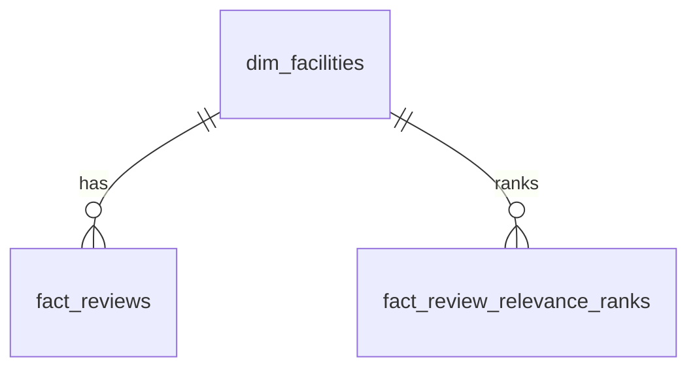

# BigQuery SQL 初心者向け解説

このドキュメントは、`sql/bigquery/` にある SQL を初心者でも追えるように説明するためのものです。

このプロジェクトでは、Python は BrightData からデータを取って GCS / BigQuery に渡すところまでを担当します。重複排除、正規化、集計しやすい形への変換は BigQuery の SQL に任せます。

## 全体像

BigQuery の中は 3 つの層に分けています。

| 層 | 役割 | テーブル |
| --- | --- | --- |
| raw layer | 取得した生データをそのまま保存する | `raw_reviews`, `raw_facilities`, `raw_serp_responses` |
| staging layer | JSON を表形式にほどく | `raw_reviews_parsed`, `raw_serp_relevance_parsed` |
| mart layer | 利用者が見るきれいなテーブルにする | `dim_facilities`, `fact_reviews`, `fact_review_relevance_ranks` |

処理順は次の通りです。

```mermaid
flowchart LR
    RawSQL["001_create_raw_tables.sql"] --> MartSQL["002_create_mart_tables.sql"]
    MartSQL --> ParseReviews["010_parse_raw_reviews.sql"]
    ParseReviews --> ParseFacilities["011_parse_raw_facilities.sql"]
    ParseFacilities --> ParseSerp["020_parse_raw_serp_responses.sql"]
    ParseSerp --> FactReviews["101_deduplicate_reviews.sql"]
    FactReviews --> FactRanks["120_build_review_relevance_ranks.sql"]
```



## まず覚えるSQLの読み方

このリポジトリの SQL では、次の書き方がよく出ます。

| 書き方 | 意味 |
| --- | --- |
| `create table if not exists` | テーブルがなければ作る。すでにあれば何もしない |
| `create or replace table ... as select` | SELECT の結果でテーブルを作り直す |
| `with name as (...)` | 一時的な名前付きの途中結果を作る |
| `select ... from ...` | テーブルから列を取り出す |
| `where ...` | 条件に合う行だけ残す |
| `coalesce(a, b, c)` | 左から見て、最初に NULL ではない値を採用する |
| `nullif(value, '')` | 空文字なら NULL にする |
| `json_value(json, '$.key')` | JSON から文字列や数値の値を取り出す |
| `json_query_array(json, '$.data')` | JSON から配列を取り出す |
| `unnest(array)` | 配列を複数行に展開する |
| `safe_cast(value as int64)` | 変換できない値はエラーではなく NULL にする |
| `row_number() over (...)` | グループ内で順位を付ける |
| `partition by` | 日付などでテーブルを分割し、読み取り量を減らす |
| `cluster by` | よく検索・結合する列でデータを並べ、速くしやすくする |

`NULL` は「値がない」という意味です。空文字 `''` とは別物です。この SQL では `nullif(..., '')` を使って、空文字を「値なし」として扱っています。

## 001_create_raw_tables.sql

この SQL は raw layer のテーブルを作ります。raw layer は「取得したデータをなるべく加工せず、そのまま置く場所」です。

作るテーブルは 3 つです。

| テーブル | 入るデータ |
| --- | --- |
| `raw_reviews` | BrightData から取ったレビューの生データ |
| `raw_facilities` | 施設情報の生データ |
| `raw_serp_responses` | SERP API のレスポンス生データ |

各 raw テーブルはほぼ同じ列を持ちます。

| 列 | 意味 |
| --- | --- |
| `source_run_id` | GitHub Actions などの実行ID |
| `raw_object_uri` | GCS 上の raw ファイルの場所 |
| `raw_payload` | JSON 文字列そのもの |
| `source_system` | データ取得元。今は `brightdata` |
| `extracted_at` | データを取得した時刻 |
| `loaded_at` | BigQuery に入れた時刻 |
| `payload_sha256` | raw payload のハッシュ値 |
| `dataset_kind` | `reviews`, `facilities`, `serp_relevance` などの種類 |

重要なのは `raw_payload` です。ここには JSON をそのまま保存します。あとから解析ロジックを直したくなっても、raw が残っていれば BrightData を再実行せずに BigQuery 上で再変換できます。

`partition by date(extracted_at)` は、取得日ごとにデータを分ける指定です。例えば「直近7日だけ」を見るとき、BigQuery が読む量を減らしやすくなります。

`cluster by source_run_id, dataset_kind` は、実行IDやデータ種別で探しやすくする指定です。

## 002_create_mart_tables.sql

この SQL は mart layer の最終テーブルを作ります。mart layer は、アプリや分析、CSV export の利用者が見るためのきれいなテーブルです。

作るテーブルは 3 つです。

| テーブル | 役割 |
| --- | --- |
| `dim_facilities` | 施設マスタ |
| `fact_reviews` | レビューの事実データ |
| `fact_review_relevance_ranks` | SERP 上のレビュー関連度順位 |

`dim_` は dimension の略で、名前や住所のような「説明情報」を持つテーブルです。

`fact_` は fact の略で、レビューや順位のような「起きた事実」を持つテーブルです。

この形はスタースキーマに近い設計です。中心に fact があり、そこから `facility_id` で dimension に結びつきます。



`fact_reviews` は `partition by review_date` を使います。レビュー投稿日で絞る分析が多いためです。

`cluster by facility_id, review_id` は、施設ごとのレビュー検索や重複確認を速くしやすくします。

## 010_parse_raw_reviews.sql

この SQL は staging layer の `raw_reviews_parsed` を作ります。raw layer の JSON を、1レビュー = 1行の表に変換します。

処理は 3 段階です。

| CTE | 役割 |
| --- | --- |
| `source_rows` | `raw_reviews` からレビュー用の raw だけ取り出す |
| `review_items` | JSON 配列を `unnest` で1件ずつの行にする |
| `normalized` | JSON の中から必要な列を取り出し、列名をそろえる |

`json_query_array(raw_payload, '$.data')` は、raw JSON の `data` という配列を取り出します。

BrightData の返却形式は、次のどちらもあり得る想定です。

```json
{"data": [{"review_id": "1"}, {"review_id": "2"}]}
```

```json
[{"review_id": "1"}, {"review_id": "2"}]
```

そのため、SQL では次のようにしています。

```sql
coalesce(
  json_query_array(raw_payload, '$.data'),
  json_query_array(raw_payload, '$')
)
```

これは「まず `$.data` を見て、なければ JSON 全体 `$` を配列として見る」という意味です。

`review_id` や `facility_id` は、データ元によって名前が違う可能性があります。そこで `coalesce` を使って候補を順番に見ています。

```sql
coalesce(
  nullif(json_value(review_json, '$.review_id'), ''),
  nullif(json_value(review_json, '$.review_gid'), ''),
  nullif(json_value(review_json, '$.id'), ''),
  to_hex(sha256(to_json_string(review_json)))
) as review_id
```

最後の `to_hex(sha256(...))` は、IDがない場合の保険です。JSON全体からハッシュ値を作り、仮のIDとして使います。

最後の `where review_id is not null and facility_id is not null` は、レビューとして最低限必要なIDがない行を落としています。

## 011_parse_raw_facilities.sql

この SQL は mart layer の `dim_facilities` を作ります。施設情報を `facility_id` ごとに1行へまとめる、施設マスタです。

このテーブルは SCD Type 1 の考え方です。SCD Type 1 は「最新の属性で上書きするマスタ」という意味です。施設名や住所が変わったら、履歴を増やすのではなく、最新の値を1行に反映します。

処理は 4 段階です。

| CTE | 役割 |
| --- | --- |
| `source_rows` | `raw_facilities` から施設用の raw だけ取り出す |
| `facility_items` | JSON 配列を1施設ずつの行にする |
| `normalized` | 施設ID、名前、住所、URLなどを取り出す |
| `deduped` | `facility_id` ごとに1行だけ残すための順位を付ける |

`facility_id` も `review_id` と同じく、複数の候補から選びます。

```sql
coalesce(
  nullif(json_value(facility_json, '$.facility_id'), ''),
  nullif(json_value(facility_json, '$.place_id'), ''),
  nullif(json_value(facility_json, '$.fid'), ''),
  nullif(json_value(facility_json, '$.gid'), ''),
  nullif(json_value(facility_json, '$.url'), ''),
  to_hex(sha256(to_json_string(facility_json)))
) as facility_id
```

`deduped` では、同じ `facility_id` の中で次の値を計算しています。

| 式 | 意味 |
| --- | --- |
| `min(first_seen_at) over (partition by facility_id)` | その施設を初めて見た時刻 |
| `max(updated_at) over (partition by facility_id)` | その施設を最後に更新した時刻 |
| `row_number() over (...)` | どの行を代表として採用するかの順位 |

最後に `where row_num = 1` とすることで、施設IDごとに代表の1行だけを残します。

## 020_parse_raw_serp_responses.sql

この SQL は staging layer の `raw_serp_relevance_parsed` を作ります。SERP API のレスポンスから、レビューの順位らしき情報を1行ずつ取り出します。

SERP のレスポンスは形が変わりやすいので、複数の候補配列を見ています。

```sql
coalesce(
  json_query_array(raw_payload, '$.response.reviews'),
  json_query_array(raw_payload, '$.response.place.reviews'),
  json_query_array(raw_payload, '$.response.organic'),
  json_query_array(raw_payload, '$.response.results'),
  json_query_array(raw_payload, '$.response.data'),
  json_query_array(raw_payload, '$.response'),
  array<string>[]
)
```

これは「reviews があれば reviews、なければ organic、results、data の順に探す」という意味です。どれもなければ空配列にして、処理が壊れないようにします。

`with offset as rank_offset` は、配列の何番目かを取るための書き方です。SQL では0始まりなので、`rank_offset + 1 as rank_position` として、人間が見やすい1位、2位、3位にしています。

`rank_source` は、どの配列から順位を作ったかを残す列です。たとえば `response.reviews` 由来なのか、`response.organic` 由来なのかが後から分かります。

最後に `facility_id is not null` と `rank_position is not null` の行だけ残します。

## 101_deduplicate_reviews.sql

この SQL は mart layer の `fact_reviews` を作ります。`raw_reviews_parsed` にあるレビュー候補から、重複を消して最終レビューfactにします。

ポイントは `row_number()` です。

```sql
row_number() over (
  partition by facility_id, review_id
  order by extracted_at desc, loaded_at desc
) as row_num
```

これは次の意味です。

| 部分 | 意味 |
| --- | --- |
| `partition by facility_id, review_id` | 同じ施設の同じレビューを1グループにする |
| `order by extracted_at desc, loaded_at desc` | 新しく取得・ロードしたものを上にする |
| `row_number()` | グループ内で1, 2, 3...と順位を付ける |

その後、`where row_num = 1` で最新の1件だけ残します。

これにより、Pythonで巨大なCSVをループして重複排除する必要がなくなります。BigQueryの並列処理に任せる設計です。

## 120_build_review_relevance_ranks.sql

この SQL は mart layer の `fact_review_relevance_ranks` を作ります。SERP から取り出した順位情報を、最終的に使いやすいfactにします。

ここでも `row_number()` で重複排除します。

```sql
row_number() over (
  partition by facility_id, review_id, rank_source
  order by extracted_at desc, loaded_at desc, rank_position asc
) as row_num
```

レビューの重複排除との違いは、`rank_source` もグループ条件に入れていることです。

同じレビューでも、`response.reviews` 由来と `response.organic` 由来では意味が違う可能性があります。そのため、どの配列から来た順位かを分けて扱います。

`order by` では、まず新しい取得データを優先します。同じ取得タイミングなら、順位が小さいもの、つまり上位に出たものを優先します。

## なぜPythonではなくSQLでやるのか

このプロジェクトの考え方は「得意なレイヤーに得意な仕事をさせる」です。

Pythonで大量データを読み込み、ループで重複排除すると、データ量が増えたときにメモリや処理時間がボトルネックになります。

BigQuery は大量データの読み取り、並べ替え、グループ化、重複排除が得意です。`partition by`、`cluster by`、`row_number()` を使うことで、数千万件以上でも処理をDWH側に寄せられます。

このため、v2 では次の責務分担にしています。

| 処理 | 担当 |
| --- | --- |
| BrightDataから取得する | Python |
| raw JSONを保存する | GCS / BigQuery raw |
| JSONを表にほどく | BigQuery staging SQL |
| 重複排除する | BigQuery mart SQL |
| CSV互換出力する | BigQuery export |

## 読む順番

初心者が読むなら、次の順番がおすすめです。

1. `001_create_raw_tables.sql`
2. `002_create_mart_tables.sql`
3. `010_parse_raw_reviews.sql`
4. `101_deduplicate_reviews.sql`
5. `011_parse_raw_facilities.sql`
6. `020_parse_raw_serp_responses.sql`
7. `120_build_review_relevance_ranks.sql`

先に raw と mart の入れ物を理解し、その後に「レビューJSONをほどく」「重複を消す」という流れを見ると追いやすいです。
